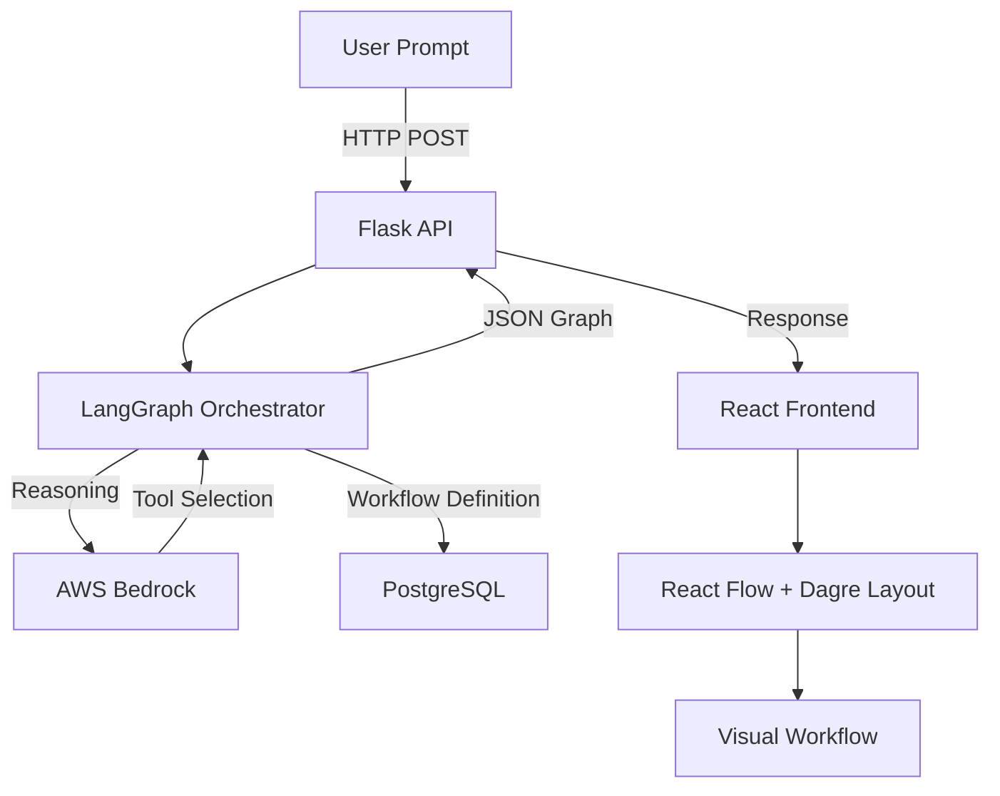

# AI Workflow Builder

A powerful AI-driven platform that converts natural language prompts into visual, executable workflows. This project leverages advanced LLM orchestration to design complex integration flows automatically.

## 🚀 Overview

The AI Workflow Builder allows users to describe a business process or technical integration in plain English. The system then:
1. **Analyzes** the intent using AWS Bedrock.
2. **Identifies** the necessary integrations and tools.
3. **Orchestrates** the logic using LangGraph for stateful multi-step reasoning.
4. **Visualizes** the resulting workflow in a dynamic, hierarchical UI.

## 🛠 Technologies Used

### Frontend
- **React 19**: modern UI framework.
- **Vite**: Ultra-fast build tool and dev server.
- **React Flow (@xyflow/react)**: For building the node-based workflow editor.
- **Dagre**: Automatic hierarchical layout algorithms.
- **Lucide React**: Beautiful, consistent icon set.

### Backend
- **Flask**: Python web framework for the API layer.
- **LangGraph**: Orchestration framework for complex agentic workflows.
- **LangChain**: LLM integration and tool management.
- **PostgreSQL**: Relational database for storing workflow definitions.
- **Redis**: For task queuing and fast state management.

### Infrastructure
- **Docker & Docker Compose**: Containerization for seamless deployment.
- **AWS Bedrock**: Enterprise-grade AI models for reasoning and generation.
- **pgAdmin**: Web-based administration interface for PostgreSQL.

## 🔄 Project Flow



### 🧠 Orchestration Detail
The backend uses a `planner_node` in `agent_graph.py` to:
- Parse the user prompt.
- Match requirements against a predefined `INTEGRATION_MAP` (e.g., AWS, Github, Slack).
- Generate a validated JSON schema that the frontend understand.
- Auto-fix common LLM formatting errors (like missing node connections or incorrect variable syntax).

## 📝 Case Study: AWS WAF Integration

**Prompt**: *"Create a workflow that blocks the IP '1.2.3.4' in AWS WAF using integration ID 5 and 'ipset_name' as 'my-blocked-ips', then logs the status."*

**Generated Workflow Structure**:
The system generates a sequence: `Webhook Trigger` -> `AWS Integration (block_ip_waf)` -> `Log Node`.

```json
{
  "integration_id": 5,
  "integration_type_name": "Aws",
  "task": "block_ip_waf",
  "params": {
    "ip": "1.2.3.4",
    "ipset_name": "my-blocked-ips",
    "scope": "CLOUDFRONT"
  }
}
```

## ⚠️ Troubleshooting & Common Errors

### 1. Resource Not Found (e.g., IP Set Missing)
> [!IMPORTANT]
> The AI Workflow Builder *designs* the flow, but execution requires the target resources to exist in your environment.

**Error**: `IP set 'blocked-ips' not found`
- **Cause**: The workflow tried to interact with an AWS IP Set that doesn't exist in the specified region/scope.
- **Solution**: 
    - Ensure the IP Set is pre-created in the AWS Console.
    - Check that your integration permissions (IAM) allow the backend to perform `wafv2:GetIPSet` and `wafv2:UpdateIPSet`.
    - Verify the `scope` (CLOUDFRONT vs REGIONAL) matches your resource.

### 2. AWS Credentials / Bearer Token
If the workflow planning fails, ensure your `.env` has a valid `AWS_BEARER_TOKEN_BEDROCK`. This is required for the LLM to process your requests.

## ⚙️ Setup & Installation

### Prerequisites
- [Docker](https://www.docker.com/products/docker-desktop/) and [Docker Compose](https://docs.docker.com/compose/install/) installed.
- AWS Credentials with access to **AWS Bedrock**.

### 1. Environment Configuration
Create a `.env` file in the root directory and add your AWS Bedrock bearer token:

```env
AWS_BEARER_TOKEN_BEDROCK=your_bearer_token_here
```

### 2. Run with Docker Compose
From the root directory, execute:

```bash
docker compose up --build
```

### 3. Access the Application
- **Frontend**: [http://localhost:8081](http://localhost:8081)
- **Backend API**: `http://localhost:5001`
- **pgAdmin**: [http://localhost:5051](http://localhost:5051) (User: `admin@admin.com`, Pass: `admin`)

## 📂 Project Structure

- `frontend/src/components/`: Core UI components like `WorkflowCanvas` and `CustomNode`.
- `backend/agent_graph.py`: The "brain" of the project using LangGraph.
- `backend/app.py`: Flask entry point.
- `backend/models.py`: Database schema definitions.
